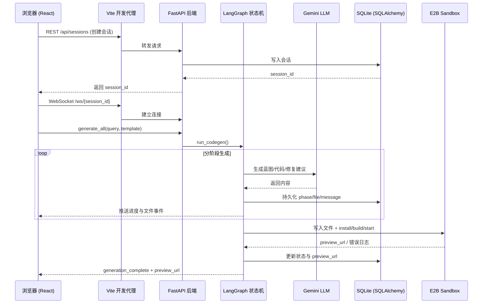

# VibeHub

基于 AI 的全栈应用生成平台。用自然语言描述你的应用想法，VibeHub 通过多阶段 Agent 流水线自动生成完整代码。

## 架构概览



- **后端** -- Python / FastAPI / LangGraph / SQLAlchemy / SQLite
- **前端** -- React 19 / TypeScript / Vite / TailwindCSS v4 / Monaco Editor

## 项目结构

```
vibehub/
├── backend/
│   ├── main.py                         # FastAPI 应用入口
│   ├── config.py                       # Pydantic Settings 配置（加载 .env）
│   ├── agent/
│   │   ├── graph.py                    # LangGraph 状态图 + run_codegen()
│   │   ├── state.py                    # CodeGenState 状态类型定义
│   │   ├── prompts.py                  # 各阶段系统提示词
│   │   ├── callback_registry.py        # WebSocket 回调注册表
│   │   └── nodes/
│   │       ├── blueprint.py            # 蓝图生成节点
│   │       ├── phase_implementation.py # 阶段实现节点
│   │       ├── review_cycle.py         # 代码审查节点
│   │       └── finalizing.py           # 完成节点
│   ├── api/
│   │   ├── routes.py                   # REST 接口（会话 CRUD）
│   │   ├── websocket.py                # WebSocket 处理器 + ConnectionManager
│   │   └── schemas.py                  # Pydantic 请求/响应模型
│   └── db/
│       ├── database.py                 # 异步 SQLAlchemy 引擎 + 初始化
│       ├── models.py                   # ORM 模型（Session, GeneratedFile, Phase, Message）
│       └── crud.py                     # 异步 CRUD 操作
│
├── frontend/
│   ├── src/
│   │   ├── routes/                     # home.tsx（首页）、chat.tsx（聊天界面）
│   │   ├── components/
│   │   │   ├── chat/                   # ChatInput、Messages、AIMessage、UserMessage
│   │   │   ├── editor/                 # CodeEditor、FileExplorer、EditorPanel
│   │   │   ├── preview/                # PreviewIframe（实时预览）
│   │   │   └── timeline/               # PhaseTimeline（阶段时间线）
│   │   ├── hooks/                      # use-chat.ts、use-auto-scroll.ts
│   │   ├── lib/                        # api-client.ts、websocket-client.ts、cn.ts
│   │   ├── types/                      # api.ts、websocket.ts
│   │   └── styles/                     # globals.css（Tailwind 样式）
│   ├── vite.config.ts
│   └── package.json
│
└── README.md
```

## 状态机流程

代码生成流水线由 LangGraph StateGraph 驱动：

```
START -> 蓝图生成 -> 阶段实现 -> 代码审查 -+-> 完成 -> END
                       ^                    |
                       +---(还有更多阶段)---+
```

每个节点通过全局回调注册表，经 WebSocket 将进度实时推送到浏览器。

## 前置要求

- **Python** >= 3.11
- **Node.js** >= 18
- **uv**（推荐）或 pip 用于 Python 依赖管理
- 一个 **Google AI API Key**（用于 Gemini 模型）

## 快速启动

### 1. 后端

```bash
cd backend

# 创建虚拟环境并安装依赖
uv venv
uv pip install -e .
# 或使用 pip：
# python -m venv .venv && .venv/Scripts/activate && pip install -e .

# 配置环境变量
cp .env.example .env
# 编辑 .env，填入你的 GOOGLE_API_KEY

# 启动服务
uvicorn main:app --reload --port 8000
```

### 2. 前端

```bash
cd frontend

npm install
npm run dev
```

打开浏览器访问 **http://localhost:5173**。

## 环境变量

在 `backend/.env` 中配置以下变量：

| 变量名 | 必填 | 默认值 | 说明 |
|---|---|---|---|
| `GOOGLE_API_KEY` | 是 | -- | Google AI API 密钥（Gemini） |
| `GEMINI_MODEL` | 否 | `gemini-3-flash` | LLM 模型标识 |
| `DATABASE_URL` | 否 | `sqlite+aiosqlite:///./vibehub.db` | SQLAlchemy 异步数据库连接串 |
| `FRONTEND_URL` | 否 | `http://localhost:5173` | 前端地址（用于 CORS） |
| `E2B_API_KEY` | 否 | -- | E2B 沙箱 API 密钥（代码执行用） |
| `DEBUG` | 否 | `true` | 开启调试日志 |

## API 接口

### REST 端点

| 方法 | 路径 | 说明 |
|---|---|---|
| `POST` | `/api/sessions` | 创建新会话 |
| `GET` | `/api/sessions` | 获取会话列表 |
| `GET` | `/api/sessions/{id}` | 获取会话详情 |

### WebSocket

连接地址：`ws://localhost:5173/ws/{session_id}`（通过 Vite 代理转发到后端）

**客户端 -> 服务端消息：**

- `session_init` -- 初始化会话，返回当前状态
- `generate_all` -- 携带 query 开始代码生成
- `user_suggestion` -- 发送后续修改建议
- `stop_generation` -- 中止当前生成任务

**服务端 -> 客户端消息：**

- `agent_connected` -- 连接建立，包含当前状态
- `phase_start` / `phase_complete` -- 阶段生命周期事件
- `file_generated` -- 文件已生成或更新
- `conversation_response` -- AI 流式响应
- `error` -- 错误信息
- `generation_stopped` -- 生成已取消

## 技术栈

| 层级 | 技术 |
|---|---|
| 前端框架 | React 19 + TypeScript |
| 构建工具 | Vite 7 |
| 样式方案 | TailwindCSS v4 |
| 代码编辑器 | Monaco Editor |
| 动画库 | Framer Motion |
| 图标库 | Lucide React |
| 路由 | React Router v7 |
| 后端框架 | FastAPI |
| Agent 编排 | LangGraph（StateGraph） |
| LLM 供应商 | Google Gemini（默认：`gemini-3-flash`） |
| ORM | SQLAlchemy（异步） |
| 数据库 | SQLite（aiosqlite） |
| 沙箱 | E2B（规划中） |

## 本地开发

```bash
# 后端（终端 1）
cd backend
uvicorn main:app --reload --port 8000

# 前端（终端 2）
cd frontend
npm run dev
```

Vite 开发服务器在端口 5173 启动，自动将 `/api/*` 和 `/ws/*` 请求代理到后端的 8000 端口。

## 许可证

私有项目 -- 保留所有权利。
