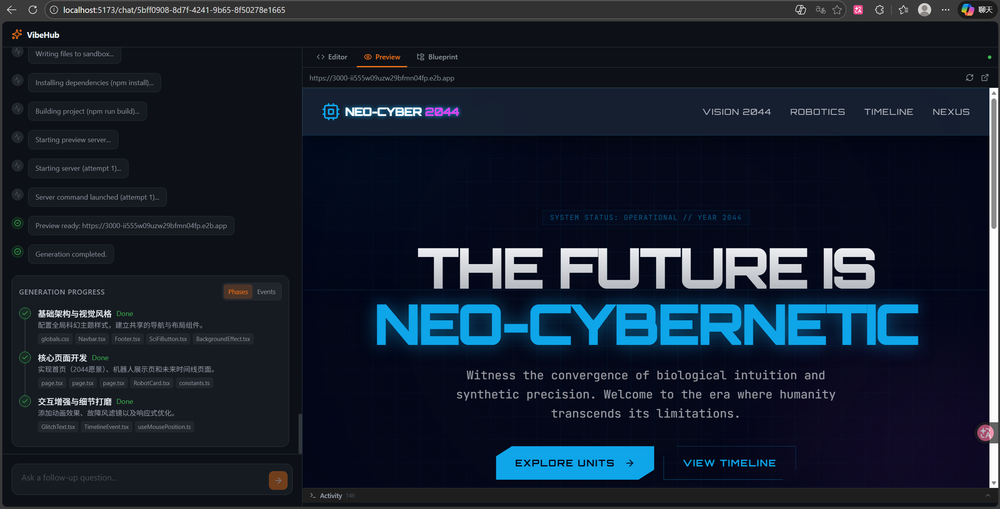
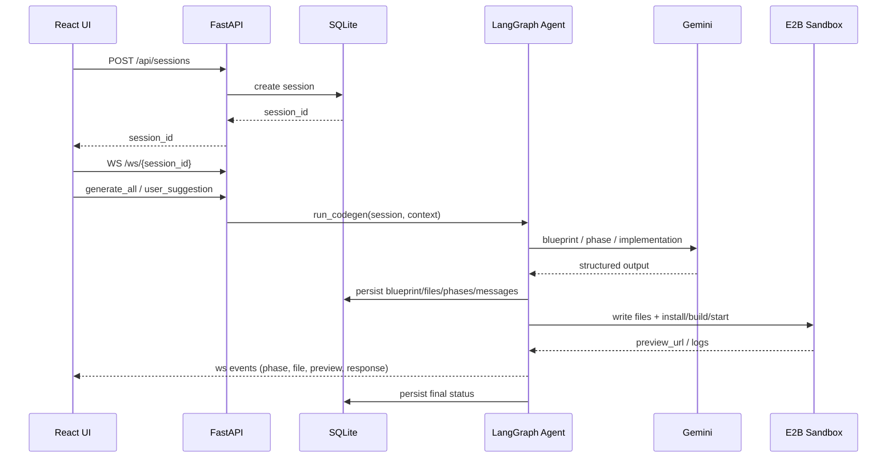

# VibeHub

一个基于 AI 的全栈应用生成平台。你只需要描述需求，系统会按阶段生成代码、执行沙箱预览、持久化会话，并支持在任意时点继续迭代。



## 功能概览

- 会话持久化：`Session / GeneratedFile / Phase / Message` 全量落库。
- 断点恢复：页面刷新或重连后可恢复会话状态；未完成生成任务可自动续跑。
- 增量迭代：生成中和生成后都可继续提需求（`user_suggestion`），系统按当前代码继续改。
- 蓝图双轨：
  - 结构化蓝图（JSON）作为流程执行真源；
  - 同步生成 `Blueprint.md`（`blueprint_markdown`）用于展示与后续约束。
- 混合时间线：聊天消息与系统执行事件（phase/sandbox/generation）在左侧统一展示。
- 右侧工作区：`Editor / Preview / Blueprint` 三个视图。

## 架构概览



## 项目结构

```text
vibehub/
├─ backend/
│  ├─ main.py
│  ├─ config.py
│  ├─ api/
│  │  ├─ routes.py
│  │  ├─ schemas.py
│  │  └─ websocket.py
│  ├─ agent/
│  │  ├─ graph.py
│  │  ├─ state.py
│  │  ├─ prompts.py
│  │  └─ nodes/
│  │     ├─ blueprint.py
│  │     ├─ phase_implementation.py
│  │     ├─ sandbox_execution.py
│  │     ├─ sandbox_fix.py
│  │     └─ finalizing.py
│  └─ db/
│     ├─ database.py
│     ├─ models.py
│     └─ crud.py
├─ frontend/
│  ├─ src/
│  │  ├─ routes/
│  │  ├─ hooks/
│  │  ├─ components/
│  │  ├─ lib/
│  │  └─ types/
│  └─ package.json
└─ README.md
```

## 快速开始

### 1) 启动后端

```bash
cd backend

uv venv
uv pip install -e .

cp .env.example .env
# 填写 GOOGLE_API_KEY、E2B_API_KEY

uvicorn main:app --reload --port 8000
```

### 2) 启动前端

```bash
cd frontend
npm install
npm run dev
```

访问：`http://localhost:5173`

## 环境变量（backend/.env）

| 变量 | 必填 | 默认值 | 说明 |
|---|---|---|---|
| `GOOGLE_API_KEY` | 是 | - | Gemini API Key |
| `GEMINI_MODEL` | 否 | `gemini-3-flash` | 模型名 |
| `DATABASE_URL` | 否 | `sqlite+aiosqlite:///./vibehub.db` | 数据库连接 |
| `FRONTEND_URL` | 否 | `http://localhost:5173` | CORS 来源 |
| `E2B_API_KEY` | 是 | - | E2B 沙箱 Key |
| `DEBUG` | 否 | `true` | 调试开关 |

## API

### REST

| 方法 | 路径 | 说明 |
|---|---|---|
| `POST` | `/api/sessions` | 创建会话 |
| `GET` | `/api/sessions` | 会话列表 |
| `GET` | `/api/sessions/{id}` | 会话详情（含 blueprint、blueprint_markdown、files、phases、messages） |

### WebSocket

连接：`ws://localhost:5173/ws/{session_id}`（通过 Vite 代理）

客户端 -> 服务端：

- `session_init`
- `generate_all`
- `user_suggestion`
- `stop_generation`

服务端 -> 客户端（核心事件）：

- `agent_connected`
- `generation_started` / `generation_complete` / `generation_stopped`
- `blueprint_generated`（含 `blueprint` + `blueprint_markdown`）
- `phase_generating` / `phase_implementing` / `phase_implemented` / `phase_validated`
- `file_generating` / `file_chunk_generated` / `file_generated`
- `sandbox_status` / `sandbox_log` / `sandbox_preview` / `sandbox_error`
- `conversation_response`
- `error`

## 会话与蓝图持久化

`sessions` 表关键字段：

- `blueprint`：结构化 JSON 蓝图（流程真源）
- `blueprint_markdown`：蓝图文档文本（展示与约束）
- `status`、`preview_url`、`template_name`

相关子表：

- `generated_files`：最终文件快照
- `phases`：阶段状态
- `messages`：`user/assistant/system` 消息与过程事件

## 当前实现边界

- 默认 LLM 为 Gemini（已移除 OpenRouter 依赖要求）。
- Deploy 到云平台不是当前最小闭环的一部分（可后续扩展）。

## 许可证

私有项目，保留所有权利。
